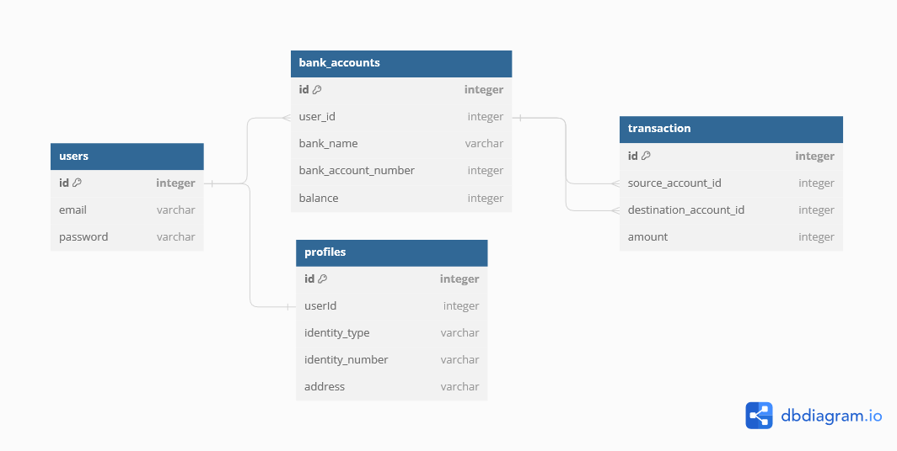

# binar-challenge-4-expressjs
Challenge Chapter 4 - Nodejs, Express Js, Prisma - Bootcamp Backend Binar Academy

## Project Setup
Clone the project from GitHub repository :

      git clone https://github.com/wahyupambudi/binar-challenge-4-expressjs
      
change directory :

      cd binar-challenge-4-expressjs

Install all package dependencies :

      npm install

Run Prisma Migrate :

      npx prisma migrate dev

Compile and hot-reload for development :

      npm run dev

## Environment Variables Settings

There is a required environment variable that needs to be set in `.env`
submit:

- PORT
  
  Port address to provide access to localhost for development purposes. You can assign a port address according to the available port, such as 8000, 8080 or etc.
  
- DATABASE_URL
  
  Database URL credentials to provide access to the Database. You can contact the administrator to get the adrress url.

## Tech Stack
- [x] Express Js
- [x] Prisma
- [x] PostgresSQL 16
- [x] PgAdmin V7
- [x] Postman
- [x] Visual Studio Code
- [x] DBDiagram

## Entity Relationship Diagram

      
## Reference
[Installation](https://www.npmjs.com/package/express) | [API Reference](https://expressjs.com/en/4x/api.html#app) | [Prisma Documentation](https://www.prisma.io/docs/concepts/overview/what-is-prisma) | [Swagger Documentation](https://swagger.io/)